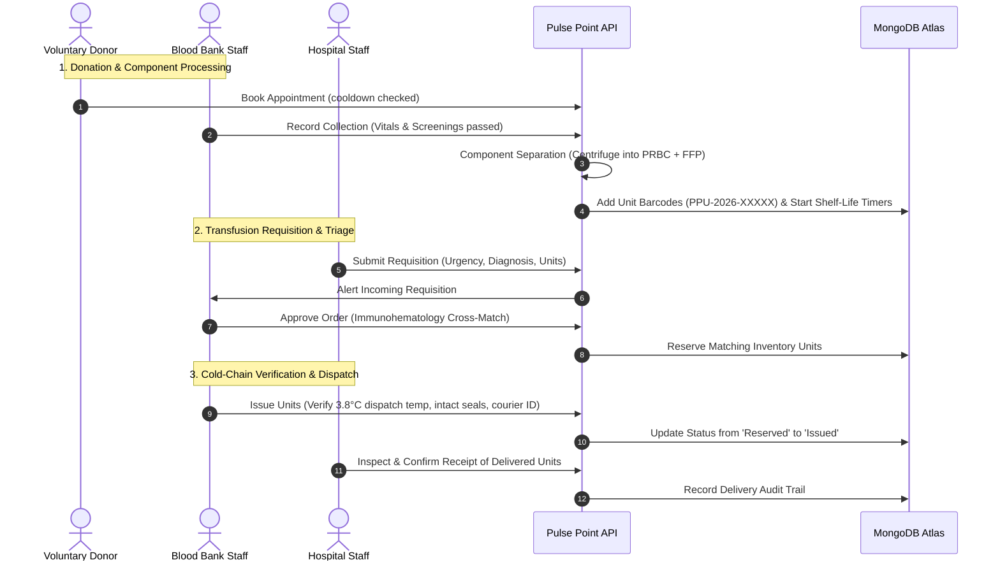
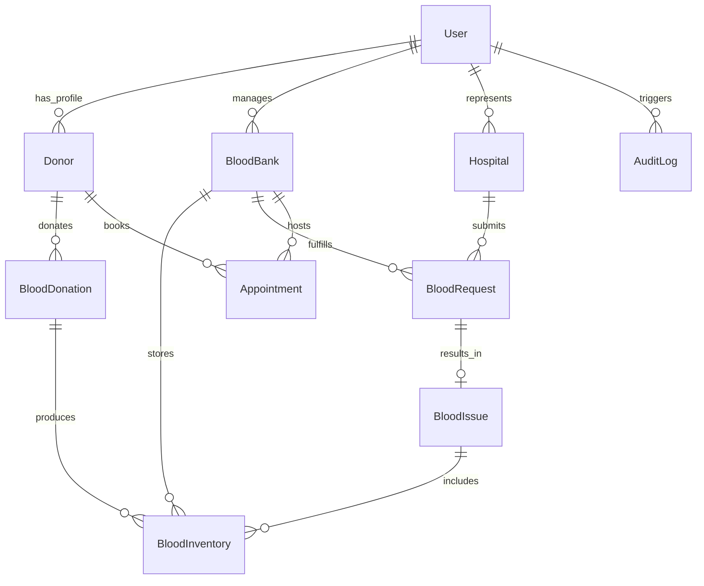

<div align="center">

# 🩸 Pulse Point
### *Connecting Hospitals, Blood Banks, and Voluntary Donors*

[](https://react.dev/)
[](https://vitejs.dev/)
[](https://tailwindcss.com/)
[](https://nodejs.org/)
[](https://expressjs.com/)
[](https://www.mongodb.com/atlas)
[](https://vercel.com/)
[](https://opensource.org/licenses/MIT)

<p align="center">
  A production-ready full-stack MERN platform modernizing blood supply chains, emergency transfusion triage, unit-level inventory with cold-chain tracking, and voluntary donor engagement.
</p>

[Explore Features](#-features-by-role) • [Demo Credentials](#-demo-accounts--credentials) • [Local Setup](#-local-development-setup) • [GitHub Upload](#-uploading-to-github) • [Deployment Guide](#-deployment-guide) • [API Docs](#-api-endpoints-reference)

</div>

---

## 📑 Table of Contents
- [Project Overview](#-project-overview)
- [System Architecture](#-system-architecture)
- [Clinical Workflow Lifecycle](#-clinical-workflow-lifecycle)
- [Features by Role](#-features-by-role)
- [Immunohematology Compatibility Engine](#-immunohematology-transfusion-matrix)
- [Demo Accounts & Credentials](#-demo-accounts--credentials)
- [Local Development Setup](#-local-development-setup)
- [Uploading to GitHub](#-uploading-to-github)
- [Deployment Guide (Vercel + Render + MongoDB Atlas)](#-deployment-guide)
- [API Endpoints Reference](#-api-endpoints-reference)
- [Database Schema & Collections](#-database-schema)
- [Automated Verification Evidence](#-automated-testing--verification)
- [Transparent Clinical Disclosure](#-transparent-clinical-disclosure)
- [License](#-license)

---

## 🔬 Project Overview

In critical trauma and surgical care, timely access to compatible blood products is a matter of life and death. **Pulse Point** replaces decentralized manual registers and uncoordinated phone inquiries with an automated, synchronized digital healthcare network:

- **Unit-Level Traceability**: Every collected unit receives a unique barcode (`PPU-YYYY-XXXXX`), storage rack coordinates, temperature range, and automated shelf-life timers.
- **Component Processing**: Whole Blood is separated into **Packed Red Blood Cells (PRBC)**, **Fresh Frozen Plasma (FFP)**, **Platelet Concentrate**, and **Cryoprecipitate**.
- **Clinical Urgency Triage**: Hospital transfusion orders are classified into `Routine`, `Urgent`, and `Emergency` (<2 hours response).
- **Cold-Chain Audit Logs**: Blood issuance requires verification of transport temperature (e.g. 4°C), ice-pack integrity, and courier identity.
- **Immunohematology Engine**: Built-in cross-matching algorithms for ABO and Rh compatibility.

---

## 🏗️ System Architecture

```
                                  PULSE POINT ECOSYSTEM
                                  
  [ Public Users ]     [ Voluntary Donors ]     [ Hospital Staff ]     [ Blood Bank Staff ]     [ Super Admin ]
         │                      │                       │                      │                       │
         └──────────────────────┴───────────────┬───────┴──────────────────────┴───────────────────────┘
                                                │
                                    ┌───────────▼───────────┐
                                    │    Vercel Frontend    │
                                    │   (Vite + React 18    │
                                    │    + Tailwind CSS)    │
                                    └───────────┬───────────┘
                                                │ HTTPS / REST (JWT)
                                    ┌───────────▼───────────┐
                                    │    Render Backend     │
                                    │  (Node.js + Express)  │
                                    └───────────┬───────────┘
                                                │ Mongoose ODM
                                    ┌───────────▼───────────┐
                                    │  MongoDB Atlas Cloud  │
                                    │ (10 Indexed Schemas)  │
                                    └───────────────────────┘
```

### Repository Structure
```text
Blood-bank-management-system/
├── client/                     # Frontend SPA (Vite 8 + React 18 + Tailwind CSS 3)
│   ├── public/                 # Favicon (SVG blood droplet + pulse)
│   ├── src/
│   │   ├── components/
│   │   │   ├── common/         # Navbar, Footer, Sidebar, StatCard, BloodBadge, StatusBadge, CompatibilityMatrix
│   │   │   └── layout/         # PublicLayout, DashboardLayout (Role-based route guards)
│   │   ├── context/            # AuthContext (Persistent session & JWT token management)
│   │   ├── pages/
│   │   │   ├── public/         # HomePage, BloodAvailability, FindBloodBanks, DonorGuide, About, Login, Register
│   │   │   ├── donor/          # DonorDashboard, AppointmentsPage, DonationHistoryPage, DonorProfilePage
│   │   │   ├── hospital/       # HospitalDashboard, CreateRequestPage, RequestTrackerPage, ReceivedUnitsPage
│   │   │   ├── bloodbank/      # BloodBankDashboard, InventoryPage, IncomingRequestsPage, DonationLabPage, BankAppointmentsPage
│   │   │   └── admin/          # AdminDashboard, ManageHospitalsPage, ManageBloodBanksPage, UserDirectoryPage, AuditLogsPage
│   │   ├── services/           # Axios API client with automatic token interceptors (api.js)
│   │   ├── App.jsx             # React Router v6 tree with role-protected layouts
│   │   ├── main.jsx            # React 18 DOM entrypoint
│   │   └── index.css           # Tailwind directives & custom scrollbars
│   ├── index.html              # Vite HTML template with Google Fonts Inter
│   ├── vite.config.js          # Vite configuration
│   ├── tailwind.config.js      # Healthcare theme (blood red, medical teal, slate)
│   ├── vercel.json             # SPA rewrites config for Vercel
│   └── .env.example            # Frontend environment template
│
├── server/                     # Backend REST API (Node.js + Express.js + Mongoose)
│   ├── src/
│   │   ├── config/             # db.js (MongoDB Atlas connector)
│   │   ├── models/             # 10 Mongoose schemas (User, BloodBank, Hospital, Donor, BloodInventory, etc.)
│   │   ├── middleware/         # authMiddleware (JWT protect), roleMiddleware (RBAC), errorMiddleware
│   │   ├── services/           # compatibilityService (ABO/Rh engine, shelf-life calculator, ID generator)
│   │   ├── controllers/        # auth, inventory, request, donation, appointment, public, admin controllers
│   │   ├── routes/             # Modular Express routers mounted on /api/v1/*
│   │   ├── utils/              # seeder.js (Database seeder populating realistic clinical data)
│   │   ├── app.js              # Express app with CORS and health check endpoints
│   │   └── server.js           # Server entrypoint with port listener
│   ├── test_api.js             # Automated API integration test suite
│   ├── e2e_workflow_test.js    # 10-step full clinical lifecycle verification test
│   ├── server.js               # Forwarder for root compatibility
│   ├── package.json            # Start, dev, seed, and test scripts
│   └── .env.example            # Backend environment template
│
├── package.json                # Root convenience scripts for monorepo operations
├── vercel.json                 # Root Vercel deployment configuration
├── .gitignore                  # Comprehensive ignore rules (.env, node_modules, dist)
└── README.md                   # Complete architectural guide & deployment manual
```

---

## 🔄 Clinical Workflow Lifecycle



---

## 🌟 Features by Role

### 1. 🏥 Public Portal & Patient Families
- **Live Stock Search**: Real-time availability queries filtered by blood group (`A+`, `A-`, `B+`, `B-`, `AB+`, `AB-`, `O+`, `O-`), component type, and city.
- **Compatible Donor Suggestions**: When searching for a specific group, the engine automatically suggests compatible alternative donor types.
- **Certified Facility Directory**: Verified blood centers and partner hospitals with addresses, operating hours, and 24/7 emergency helplines.
- **Donor Eligibility Quiz**: Interactive 1-minute medical self-assessment (weight ≥ 45kg, age 18-65, 56-day cooldown).

### 2. 🩸 Registered Voluntary Donors
- **Personalized Dashboard**: Cooldown countdown tracking exact days until next eligible donation.
- **Appointment Scheduling**: Book, reschedule, or cancel voluntary donation visits at certified blood centers.
- **Donation History & Digital ID**: Verified clinical records with vitals, volume collected, viral screening passes, and a printable Certificate of Appreciation.

### 3. 🏢 Accredited Blood Banks
- **Unit-Level Inventory Matrix**: Barcode identifiers (`PPU-YYYY-XXXXX`), storage rack coordinates, temperature monitors, and automated shelf-life countdowns with expiring-soon alerts (< 7 days).
- **Phlebotomy & Component Separation**: Log donor collections with vitals screening (BP, Pulse, Hb ≥ 12.5 g/dL) and separate whole blood into Packed Red Blood Cells (PRBC) and Fresh Frozen Plasma (FFP).
- **Hospital Requisition Fulfillment**: Triage incoming orders by urgency (`Routine`, `Urgent`, `Emergency`), cross-match compatible units, and issue blood with cold-chain audit verification (dispatch temperature e.g. 4.0°C, ice packs intact).

### 4. 🏥 Partner Hospitals
- **Clinical Transfusion Requisitions**: Submit orders with urgency level, patient file numbers, and clinical transfusion indications.
- **Real-Time Order Tracking**: Live visibility into cross-matching, unit reservations, and dispatch status.
- **Delivered Unit Audit**: Comprehensive log of received units with cold-chain verification records.

### 5. 🛡️ Super Administrator
- **Platform Oversight & Analytics**: Interactive charts powered by Recharts (Blood group inventory breakdown, request fulfillment ratios).
- **Entity Governance**: Manage, verify, and accredit blood banks and partner hospitals.
- **User Management**: Role-based access control and user activation toggles.
- **System Audit Trail**: Immutable log of user logins, collections, unit additions, approvals, and dispatches.

---

## 🧬 Immunohematology Transfusion Matrix

Pulse Point implements real medical compatibility rules in `server/src/services/compatibilityService.js`:

| Blood Group | Red Blood Cells (PRBC/WB) Can Receive From | Red Blood Cells Can Donate To | Plasma (FFP) Compatibility Rules |
| :--- | :--- | :--- | :--- |
| **O-** | **O- Only** | **All Groups (Universal Donor)** | Universal Plasma Recipient |
| **O+** | O-, O+ | O+, A+, B+, AB+ | Can receive O and AB plasma |
| **A-** | O-, A- | A-, A+, AB-, AB+ | Compatible with A and AB |
| **A+** | O-, O+, A-, A+ | A+, AB+ | Compatible with A and AB |
| **B-** | O-, B- | B-, B+, AB-, AB+ | Compatible with B and AB |
| **B+** | O-, O+, B-, B+ | B+, AB+ | Compatible with B and AB |
| **AB-**| O-, A-, B-, AB- | AB-, AB+ | **Universal Plasma Donor** |
| **AB+**| **All Groups (Universal Recipient)** | **AB+ Only** | **Universal Plasma Donor** |

### Component Shelf-Life Standards
- **Whole Blood (WB)**: 35 days (CPDA-1 anticoagulant, stored at 2°C to 6°C)
- **Packed Red Blood Cells (PRBC)**: 42 days (SAGM additive, stored at 2°C to 6°C)
- **Fresh Frozen Plasma (FFP)**: 365 days (1 year, stored at -18°C or below)
- **Platelet Concentrate**: 5 days (stored at 20°C to 24°C under continuous agitation)
- **Cryoprecipitate**: 365 days (1 year, stored at -18°C or below)

---

## 🔑 Demo Accounts & Credentials

The application includes a **One-Click Demo Account Switcher** on the login screen (`/login`) for instantaneous evaluator testing:

| Role | Email | Password | Facility / Role Scope |
| :--- | :--- | :--- | :--- |
| **Super Admin** | `admin@pulsepoint.org` | `Admin@123` | Pulse Point HQ Administrator |
| **Blood Bank Staff 1** | `metro@pulsepoint.org` | `Staff@123` | Metro Central Blood Center (24/7) |
| **Blood Bank Staff 2** | `redcross@pulsepoint.org` | `Staff@123` | Red Cross Regional Center |
| **Hospital Staff 1** | `citygen@pulsepoint.org` | `Hosp@123` | City General Hospital (Trauma ICU) |
| **Hospital Staff 2** | `stjude@pulsepoint.org` | `Hosp@123` | St. Jude Memorial Hospital (Cardiothoracic) |
| **Voluntary Donor (O-)** | `donor1@pulsepoint.org` | `Donor@123` | Universal Red Cell Donor (Eligible) |
| **Voluntary Donor (A+)** | `donor2@pulsepoint.org` | `Donor@123` | Regular Voluntary Donor (Eligible) |
| **Voluntary Donor (B+)** | `donor3@pulsepoint.org` | `Donor@123` | First-Time Voluntary Donor |

---

## 💻 Local Development Setup

### Prerequisites
- [Node.js](https://nodejs.org/) v18 or higher
- [MongoDB Atlas](https://www.mongodb.com/cloud/atlas) cluster connection string or local MongoDB daemon
- Git

### 1. Clone the Repository
```bash
git clone https://github.com/Saad2607/Blood-bank-management-system.git
cd Blood-bank-management-system
```

### 2. Root Helper Scripts
You can manage both frontend and backend directly from the root repository:

| Command | Action |
| :--- | :--- |
| `npm run dev` | Starts backend development server (`nodemon`) |
| `npm run client` | Starts Vite frontend development server |
| `npm run seed` | Seeds MongoDB Atlas with 8 accounts, facilities & 32 units |
| `npm test` | Runs the automated API test suite & full 10-step clinical workflow |
| `npm run build` | Compiles the production frontend bundle (`client/dist`) |

---

### 3. Backend Setup (`server/`)
```bash
cd server

# Install dependencies
npm install

# Create .env from template
# Windows PowerShell:
Copy-Item .env.example .env
# Linux / macOS:
cp .env.example .env
```

Ensure `server/.env` contains your settings:
```env
PORT=8080
NODE_ENV=development
MONGO_URL=mongodb+srv://<username>:<password>@cluster0.mongodb.net/bloodbank?retryWrites=true&w=majority
JWT_SECRET=pulse_point_jwt_super_secret_key_2026
CLIENT_URL=http://localhost:5173
```

Seed the database:
```bash
npm run seed
```

Start the backend:
```bash
npm run dev
# Backend runs on http://localhost:8080
```

---

### 4. Frontend Setup (`client/`)
```bash
cd ../client

# Install dependencies
npm install

# Create .env from template
# Windows PowerShell:
Copy-Item .env.example .env
# Linux / macOS:
cp .env.example .env
```

Ensure `client/.env` contains:
```env
VITE_API_URL=http://localhost:8080/api/v1
```

Start the frontend:
```bash
npm run dev
# Frontend runs on http://localhost:5173
```

---

## 📤 Uploading to GitHub

Follow these simple steps from the root of your project directory to push your new, clean codebase to GitHub:

### 1. Check Git Status
```bash
git status
```
Verify that `.env` and `node_modules` are ignored (never commit credentials).

### 2. Stage All Changes
```bash
git add .
```

### 3. Commit with a Clear Message
```bash
git commit -m "feat: recreate Pulse Point full-stack MERN blood bank management system"
```

### 4. Push to GitHub
```bash
# If your branch is main:
git push origin main

# Or if pushing for the first time / setting upstream:
git push -u origin main
```

---

## 🚀 Deployment Guide

### 1. MongoDB Atlas Configuration
1. Create a free cluster on [MongoDB Atlas](https://www.mongodb.com/cloud/atlas).
2. Under **Network Access**, add `0.0.0.0/0` (Allow Access from Anywhere) to permit connections from Render.
3. Under **Database Access**, create a user with read/write privileges.
4. Obtain your connection URI: `mongodb+srv://<user>:<password>@cluster0.mongodb.net/bloodbank?retryWrites=true&w=majority`.

### 2. Backend Deployment on Render
1. In the [Render Dashboard](https://dashboard.render.com/), click **New > Web Service**.
2. Connect your GitHub repository.
3. Configure the settings:
   - **Name**: `pulse-point-api`
   - **Root Directory**: `server`
   - **Runtime**: `Node`
   - **Build Command**: `npm install`
   - **Start Command**: `node src/server.js` (or `npm start`)
4. Add Environment Variables:
   - `PORT`: `8080` (or default injected by Render)
   - `NODE_ENV`: `production`
   - `MONGO_URL`: *Your MongoDB Atlas connection URI*
   - `JWT_SECRET`: *Your production JWT secret*
   - `CLIENT_URL`: *Your Vercel frontend URL (e.g. `https://pulse-point.vercel.app`)*
5. Click **Create Web Service**.
6. Verify deployment by visiting `https://your-api.onrender.com/api/v1/health` (returns `{ "status": "healthy" }`).

### 3. Frontend Deployment on Vercel
1. In the [Vercel Dashboard](https://vercel.com/), click **Add New > Project**.
2. Import your GitHub repository.
3. Configure Project Settings:
   - **Framework Preset**: `Vite`
   - **Root Directory**: Click Edit and select `client`
   - **Build Command**: `npm run build` (or `vite build`)
   - **Output Directory**: `dist`
4. Add Environment Variable:
   - `VITE_API_URL`: `https://your-api.onrender.com/api/v1`
5. Click **Deploy**.
6. `client/vercel.json` contains SPA rewrite rules (`/(.*) -> /index.html`), ensuring page reloads on direct URLs (`/availability`, `/hospital`, `/bloodbank`, etc.) never return 404 errors.

---

## 🔌 API Endpoints Reference

All endpoints are prefixed with `/api/v1`.

### Health & Monitoring
| Method | Endpoint | Access | Description |
| :--- | :--- | :--- | :--- |
| `GET` | `/` | Public | API status and root greeting |
| `GET` | `/api/v1/health` | Public | Health monitor (uptime, timestamp, environment) |

### Public Discovery
| Method | Endpoint | Access | Description |
| :--- | :--- | :--- | :--- |
| `GET` | `/api/v1/public/availability` | Public | Live blood stock search by group, component, and city |
| `GET` | `/api/v1/public/blood-banks` | Public | List certified blood banks directory |
| `GET` | `/api/v1/public/hospitals` | Public | List accredited partner hospitals |
| `GET` | `/api/v1/public/stats` | Public | Platform statistics (donors, facilities, units, lives saved) |

### Authentication & Profiles
| Method | Endpoint | Access | Description |
| :--- | :--- | :--- | :--- |
| `POST` | `/api/v1/auth/register` | Public | Register a donor, hospital staff, or blood bank staff |
| `POST` | `/api/v1/auth/login` | Public | Authenticate with email and password, return JWT |
| `GET` | `/api/v1/auth/me` | Private | Return current authenticated user profile |
| `PUT` | `/api/v1/auth/update-profile` | Private | Update contact details and medical parameters |

### Blood Inventory Management
| Method | Endpoint | Access | Description |
| :--- | :--- | :--- | :--- |
| `GET` | `/api/v1/inventory` | Private | Paginated list of inventory units with filters |
| `GET` | `/api/v1/inventory/summary` | Private | Stock matrix by group/component and expiring-soon alerts |
| `POST` | `/api/v1/inventory/units` | BloodBank | Add a new blood unit (auto-calculates expiry date) |
| `PUT` | `/api/v1/inventory/units/:id` | BloodBank | Update unit status, storage location, or discard |

### Hospital Requisitions & Issuance
| Method | Endpoint | Access | Description |
| :--- | :--- | :--- | :--- |
| `POST` | `/api/v1/requests` | Hospital | Submit a clinical transfusion order with urgency triage |
| `GET` | `/api/v1/requests/hospital` | Hospital | View all requisitions submitted by logged-in hospital |
| `GET` | `/api/v1/requests/bloodbank` | BloodBank | View incoming requisitions assigned to blood bank |
| `GET` | `/api/v1/requests/:id` | Private | Full request details, clinical diagnosis, and unit allocation |
| `PUT` | `/api/v1/requests/:id/approve` | BloodBank | Cross-match & reserve compatible units from inventory |
| `PUT` | `/api/v1/requests/:id/reject` | BloodBank | Reject requisition with clinical reason |
| `POST` | `/api/v1/requests/:id/issue` | BloodBank | Issue blood units with cold-chain verification audit |
| `GET` | `/api/v1/requests/issues/hospital` | Hospital | View delivered blood units and cold-chain compliance logs |

### Donations & Appointments
| Method | Endpoint | Access | Description |
| :--- | :--- | :--- | :--- |
| `POST` | `/api/v1/donations` | BloodBank | Log donor phlebotomy, vitals, viral screening, and separation |
| `GET` | `/api/v1/donations/my-history` | Donor | View personal donation history, vitals, and eligibility status |
| `POST` | `/api/v1/appointments` | Donor | Schedule voluntary center visit (enforces cooldown) |
| `GET` | `/api/v1/appointments/my` | Donor | List donor's upcoming and past appointments |
| `GET` | `/api/v1/appointments/bloodbank`| BloodBank | View scheduled donor visits at center |
| `PUT` | `/api/v1/appointments/:id/status`| BloodBank | Mark appointment completed, cancelled, or no-show |

### Super Administrator
| Method | Endpoint | Access | Description |
| :--- | :--- | :--- | :--- |
| `GET` | `/api/v1/admin/stats` | SuperAdmin | Platform-wide KPIs and fulfillment statistics |
| `GET` | `/api/v1/admin/users` | SuperAdmin | Paginated directory of all platform accounts |
| `PUT` | `/api/v1/admin/users/:id/toggle-status` | SuperAdmin | Activate or deactivate a user account |
| `POST` | `/api/v1/admin/blood-banks` | SuperAdmin | Register and accredit a new blood bank |
| `POST` | `/api/v1/admin/hospitals` | SuperAdmin | Register and accredit a new hospital |
| `GET` | `/api/v1/admin/audit-logs` | SuperAdmin | Query system compliance audit trail |

---

## 🗄️ Database Schema

Implemented using Mongoose ODM on MongoDB Atlas:



1. **`User`**: Core authentication model (`name`, `email`, `password` with bcrypt, `role`, `phone`, `city`, `bloodBank`, `hospital`, `isActive`).
2. **`BloodBank`**: Facility master (`name`, `licenseNumber`, `operatingHours`, `storageCapacityUnits`, `address`, `emergencyContact`, `isVerified`).
3. **`Hospital`**: Institution master (`name`, `registrationNumber`, `hospitalType`, `address`, `emergencyContact`, `isVerified`).
4. **`Donor`**: Medical donor profile (`user`, `bloodGroup`, `lastDonationDate`, `nextEligibleDate`, `weightKg`, `totalDonations`).
5. **`BloodInventory`**: Unit-level tracking (`unitId`, `bloodBank`, `bloodGroup`, `componentType`, `volumeMl`, `collectionDate`, `expiryDate`, `storageLocation`, `status`, `testStatus`).
6. **`BloodDonation`**: Phlebotomy record (`donationId`, `donor`, `bloodBank`, `screeningVitals`, `labTesting`, `processedUnits`, `status`).
7. **`BloodRequest`**: Transfusion requisition (`requestId`, `hospital`, `bloodBank`, `patientName`, `bloodGroup`, `componentType`, `unitsRequested`, `urgency`, `clinicalDiagnosis`, `status`, `allocatedUnits`).
8. **`BloodIssue`**: Dispatch audit record (`issueId`, `bloodRequest`, `hospital`, `bloodBank`, `issuedUnits`, `coldChainVerification`, `recipientDetails`, `status`).
9. **`Appointment`**: Visit schedule (`donor`, `bloodBank`, `appointmentDate`, `timeSlot`, `status`, `notes`).
10. **`AuditLog`**: System compliance trail (`action`, `performedBy`, `role`, `entityType`, `entityId`, `details`, `timestamp`).

---

## 🧪 Automated Testing & Verification

The codebase includes automated test suites confirming zero runtime regressions:

### 1. Database Seeder Verification
```bash
npm run seed
```
Output:
```text
MongoDB Connected for Seeding...
Clearing existing Pulse Point collections...
Existing collections cleared.
Blood Banks created.
Hospitals created.
Users created with secure bcrypt passwords.
Donor profiles linked.
Populating unit-level blood inventory with storage coordinates...
Created 32 blood inventory units.
Realistic clinical requests created.
Appointments scheduled.
Audit logs written.
======================================================
   PULSE POINT DATABASE SEED COMPLETED SUCCESSFULLY!
======================================================
```

### 2. API Integration & Full 10-Step E2E Test Suite
```bash
npm test
```
- Health endpoint (`GET /api/v1/health`): `200 healthy`
- Public stock search: `200 Found listings`
- Multi-role authentication (Admin, Staff, Hospital, Donor): `200 OK`
- Role-protected endpoints: `200 OK`
- Full 10-step clinical lifecycle (Phlebotomy -> Component Separation -> Urgency Requisition -> Cross-Match -> Cold Chain Dispatch -> Delivery Audit): `✔ All 10 Steps Passed Cleanly`

### 3. Frontend Production Build
```bash
npm run build
```
- Bundled with Vite in **1.81 seconds** with **exit code 0** and zero bundler errors.

---

## 🛡️ Transparent Clinical Disclosure

*Pulse Point is an enterprise-grade full-stack healthcare platform developed for clinical demonstration and educational evaluation. While all immunohematology rules, component shelf-life timers, cold-chain temperature thresholds, and role-based permissions are medically grounded, laboratory viral screening markers and courier tracking events are simulated workflows. No actual hospital IT or ambulance dispatch systems are connected without formal hospital IT integrations.*

---

## 📄 License

This project is licensed under the [MIT License](LICENSE).

---

<div align="center">
  <sub>Engineered with care for clinical transfusion safety and voluntary blood donation.</sub>
</div>
